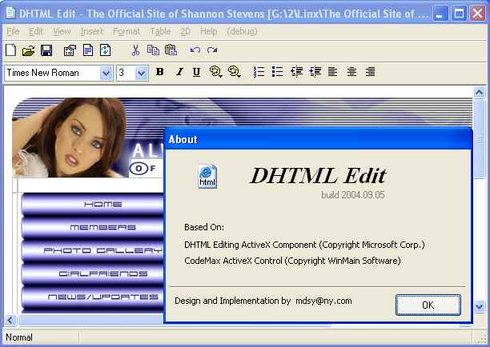



## DHTML Editor

### Description

DHTML Edit Control is an ActiveX control provided by Microsoft, they provide with it a sample app, this code is built on that app but much enhanced, to get the DHTML control goto:

http://msdn.microsoft.com/archive/default.asp?url=/archive/en-us/dnaredcom/html/cncpt.asp

also the project refrences WinMain's CodeMax control, if u don't have it, remove the refernce and replace it with a richtext box.....or whatever :-)
 
### More Info
 

             |
---                |---
**Submitted On**   |2004-09-02 06:35:22
**By**             |[M\. J\. Highlander](https://github.com/Planet-Source-Code/PSCIndex/blob/master/ByAuthor/m-j-highlander.md)
**Level**          |Advanced
**User Rating**    |5.0 (15 globes from 3 users)
**Compatibility**  |VB 6\.0
**Category**       |[Complete Applications](https://github.com/Planet-Source-Code/PSCIndex/blob/master/ByCategory/complete-applications__1-27.md)
**World**          |[Visual Basic](https://github.com/Planet-Source-Code/PSCIndex/blob/master/ByWorld/visual-basic.md)
**Archive File**   |[DHTML\_Edit18343612292004\.zip](https://github.com/Planet-Source-Code/m-j-highlander-dhtml-editor__1-57979/archive/master.zip)

